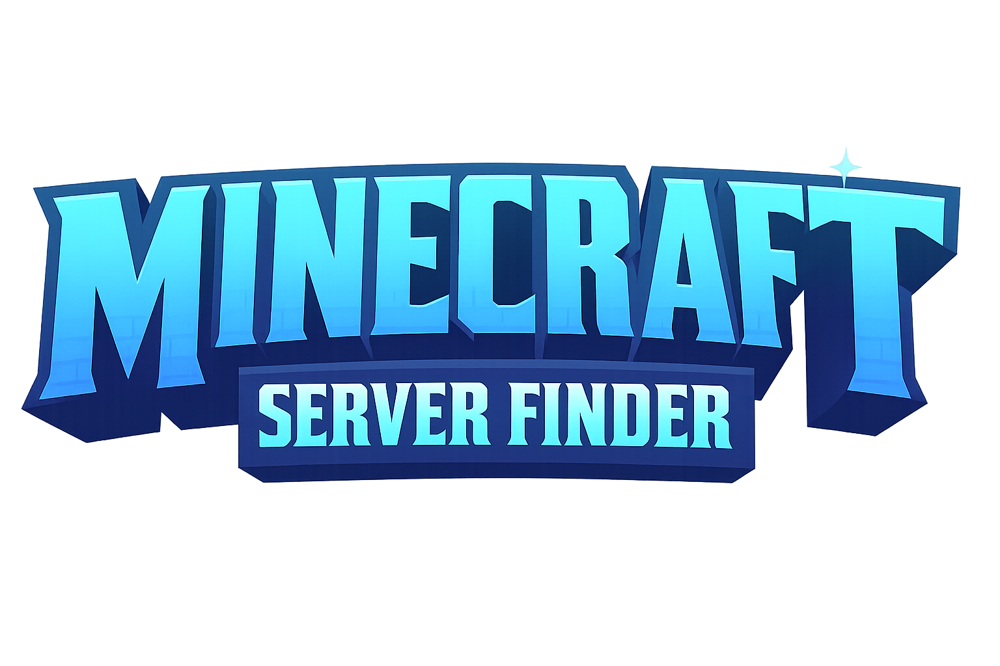

[![Contributors][contributors-shield]][contributors-url]
[![Forks][forks-shield]][forks-url]
[![Stargazers][stars-shield]][stars-url]
[![Issues][issues-shield]][issues-url]
[![MIT License][license-shield]][license-url]

<br />
<div align="center">
  <a href="https://github.com/MakeraGames/MCSFPlugin">
    
  </a>

<h1 align="center">MCServerFinder Minecraft Plugin</h1>

  <p align="center">
    The official Minecraft Plugin for <a href="https://mcserverfinder.com">MCServerFinder</a> Platform
    <br />
    <a href="https://github.com/MakeraGames/MCSFPlugin/issues/new?assignees=&labels=Requires+Testing&template=bug_report.yml">Report issue</a>
    •
    <a href="https://github.com/MakeraGames/MCSFPlugin/issues/new?assignees=&labels=Enhancement&template=feature_request.yml">Request feature</a>
    <br />
  </p>
</div>

## What is MCServerFinder?
MCServerFinder.com is a modern platform for discovering Minecraft servers, launched in April 2025. It features curated server
listings across categories like PvP, Creative, Adventure, Minigames, and more. With real-time stats, community feedback,
and trending picks, MCServerFinder makes it easy for players to find their next favorite server.

## Supported Platforms
This plugin supports various platforms, current supported ones are:
* [x] **Bukkit/Spigot/Paper and other Bukkit-based forks**: through the module `mcsf-plugin-bukkit`
* [ ] **Velocity**: through the module `mcsf-plugin-velocity`
* [ ] **BungeeCord**: through the module `mcsf-plugin-bungeecord`

## Installation
1. Get your MCServerFinder API key from the [Settings](https://mcserverfinder.com/settings/api-keys) page.
2. Get your Server ID from **Edit Server** page.
3. Download the plugin you want to include in your platform from the
    [Releases](https://github.com/MakeraGames/MCSFPlugin/releases) page.
4. Drop the plugin in your `plugins/` directory.
5. Start your server to generate the configuration file.
6. Turn off your server and go to your plugin `config.yml` (located in `plugins/mcsf-plugin/` for velocity,
    and `plugins/MCSFPlugin/` for other platforms) put the API key there:
    ```yaml
   settings:
       apiKey: "put-your-api-key-here"
       serverId: 0 # Your Server ID here
    ```
7. Done! the plugin is ready-to-go.

## Leaderboards
Configuring leaderboards is easy and simple, it can be done with fewer steps:
1. Configure your leaderboards from your **Edit Server** page.
2. In plugin configuration, you can configure the leaderboard:
   ```yaml
   leaderboardSettings:
       enabled: true # You can toggle leaderboards functionality
       updateInterval: 2 # What should be the period between each push in minutes
       leaderboards:
       - id: 'player_kills' # Leaderboard name in MCServerFinder Server panel
         placeholder: '%player_kills%' # PlaceholderAPI placeholder which will be used to retrieve stats for leaderboard
    ```

Just like that, you have successfully configured leaderboards 🎉!

## Contributions
We welcome community contributions through pull requests!

# Licensing
This project is licensed under [MIT License](https://opensource.org/licenses/MIT),
you can read it at [LICENSE](https://github.com/MakeraGames/MCSFPlugin/LICENSE) file

<!-- MARKDOWN LINKS & IMAGES -->
<!-- https://www.markdownguide.org/basic-syntax/#reference-style-links -->
<!-- MARKDOWN LINKS & IMAGES -->
<!-- https://www.markdownguide.org/basic-syntax/#reference-style-links -->
[contributors-shield]: https://img.shields.io/github/contributors/MakeraGames/MCSFPlugin.svg?style=for-the-badge
[contributors-url]: https://github.com/MakeraGames/MCSFPlugin/graphs/contributors
[forks-shield]: https://img.shields.io/github/forks/MakeraGames/MCSFPlugin.svg?style=for-the-badge
[forks-url]: https://github.com/MakeraGames/MCSFPlugin/network/members
[stars-shield]: https://img.shields.io/github/stars/MakeraGames/MCSFPlugin.svg?style=for-the-badge
[stars-url]: https://github.com/MakeraGames/MCSFPlugin/stargazers
[issues-shield]: https://img.shields.io/github/issues/MakeraGames/NotMCSFPlugin.svg?style=for-the-badge
[issues-url]: https://github.com/MakeraGames/MCSFPlugin/issues
[license-shield]: https://img.shields.io/github/license/MakeraGames/MCSFPlugin.svg?style=for-the-badge
[license-url]: https://github.com/MakeraGames/MCSFPlugin/blob/master/LICENSE
[product-screenshot]: .github/images/mcsf-logo.png